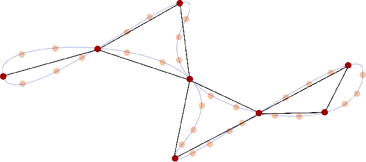

{{ page.authors }}

## Abstract

> Pose graph optimization is a non-convex optimization problem encountered in many areas of robotics perception. Its convergence to an accurate solution is conditioned by two factors: the non-linearity of the cost function in use and the initial configuration of the pose variables. In this letter, we present HiPE, a novel hierarchical algorithm for pose graph initialization. Our approach exploits a coarse-grained graph that encodes an abstract representation of the problem geometry. We construct this graph by combining maximum likelihood estimates coming from local regions of the input. By leveraging the sparsity of this representation, we can initialize the pose graph in a non-linear fashion, without computational overhead compared to existing methods. The resulting initial guess can effectively bootstrap the fine-grained optimization that is used to obtain the final solution. In addition, we perform an empirical analysis on the impact of different cost functions on the final estimate. Our experimental evaluation shows that the usage of HiPE leads to a more efficient and robust optimization process, comparing favorably with state-of-the-art methods.

## Resources

<a href=" {{ page.paperurl }} ">[pdf]</a> <a href=" {{ page.arxiv }} ">[arxiv]</a> <a href=" {{ page.code }} ">[github]</a> <a href=" {{ page.video }} ">[video]</a> <a href=" {{ page.poster }} ">[video]</a>

## Bibtex 
    @article{guadagnino2021hipe,
    title={HiPE: Hierarchical Initialization for Pose Graphs},
    author={Guadagnino, Tiziano and Di Giammarino, Luca and Grisetti, Giorgio},
    journal={IEEE Robotics and Automation Letters},
    volume={7},
    number={1},
    pages={287--294},
    year={2021},
    publisher={IEEE}
    }