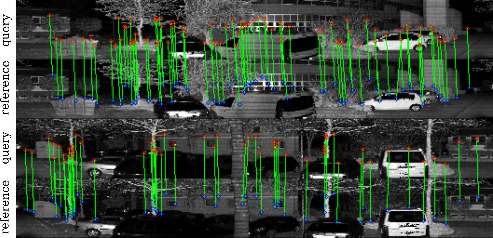

{{ page.authors }}

## Abstract

> Robots and autonomous systems need to know where they are within a map to navigate effectively. Thus, simultaneous localization and mapping or SLAM is a common building block of robot navigation systems. When building a map via a SLAM system, robots need to re-recognize places to find loop closure and reduce the odometry drift. Image-based place recognition received a lot of attention in computer vision, and in this work, we investigate how such approaches can be used for 3D LiDAR data. Recent LiDAR sensors produce high-resolution 3D scans in combination with comparably stable intensity measurements. Through a cylindrical projection, we can turn this information into a 360° panoramic range image. As a result, we can apply techniques from visual place recognition to LiDAR intensity data. The question of how well this approach works in practice has only partially been investigated. This paper provides an analysis of how such visual techniques can be with LiDAR data, and we provide an evaluation on different datasets. Our results suggest that this form of place recognition is possible and an effective means for determining loop closures.

## Resources

<a href=" {{ page.paperurl }} ">[pdf]</a> <a href=" {{ page.arxiv }} ">[arxiv]</a> <a href=" {{ page.code }} ">[github]</a> <a href=" {{ page.video }} ">[video]</a> <a href=" {{ page.poster }} ">[video]</a>

## Bibtex 
    @inproceedings{di2021visual,
    title={Visual place recognition using LiDAR intensity information},
    author={Di Giammarino, Luca and Aloise, Irvin and Stachniss, Cyrill and Grisetti, Giorgio},
    booktitle={2021 IEEE/RSJ International Conference on Intelligent Robots and Systems (IROS)},
    pages={4382--4389},
    year={2021},
    organization={IEEE}
    }