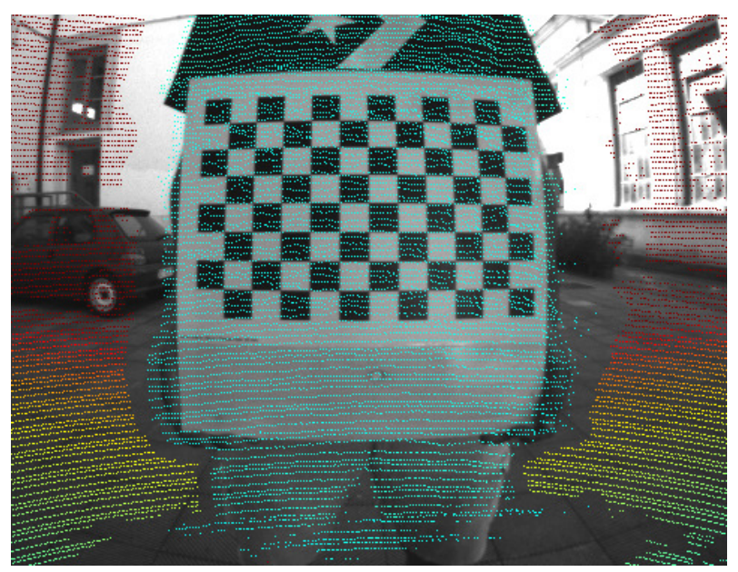

{{ page.authors }}

## Abstract

> In many fields of robotics, knowing the relative position and orientation between two sensors is a mandatory precondition to operate with multiple sensing modalities. In this context, the pair LiDAR-RGB cameras offer complementary features: LiDARs yield sparse high quality range measurements, while RGB cameras provide a dense color measurement of the environment. Existing techniques often rely either on complex calibration targets that are expensive to obtain, or extracted virtual correspondences that can hinder the estimate’s accuracy. In this paper we address the problem of LiDAR-RGB calibration using typical calibration patterns (i.e. A3 chessboard) with minimal human intervention. Our approach exploits the planarity of the target to find correspondences between the sensors measurements, leading to features that are robust to LiDAR noise. Moreover, we estimate a solution by solving a joint non-linear optimization problem. We validated our approach by carrying on quantitative and comparative experiments with other state-of-the-art approaches. Our results show that our simple schema performs on par or better than other approaches using complex calibration targets. Finally, we release an open-source C++ implementation.

## Resources

<a href=" {{ page.paperurl }} ">[pdf]</a> <a href=" {{ page.arxiv }} ">[arxiv]</a> <a href=" {{ page.code }} ">[github]</a> <a href=" {{ page.video }} ">[video]</a> <a href=" {{ page.poster }} ">[video]</a>

## Bibtex 
  @article{giacomini2024ca2lib,
  title={Ca2lib: Simple and accurate lidar-rgb calibration using small common markers},
  author={Giacomini, Emanuele and Brizi, Leonardo and Di Giammarino, Luca and Salem, Omar and Perugini, Patrizio and Grisetti, Giorgio},
  journal={Sensors},
  volume={24},
  number={3},
  pages={956},
  year={2024},
  publisher={MDPI}
}