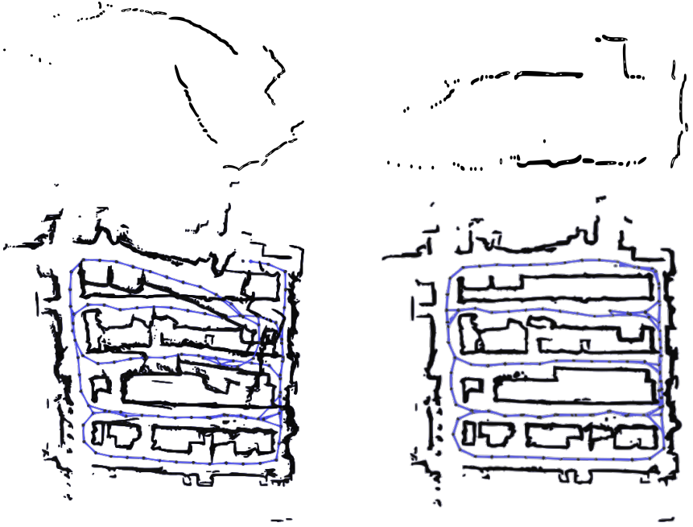

{{ page.authors }}

## Abstract

> Most commercially available Light Detection and
Ranging (LiDAR)s measure the distances along a 2D section
of the environment by sequentially sampling the free range
along directions centered at the sensor’s origin. When the sensor
moves during the acquisition, the measured ranges are affected
by a phenomenon known as “skewing”, which appears as a
distortion in the acquired scan. Skewing potentially affects
all systems that rely on LiDAR data, however it could be
compensated if the position of the sensor were known each
time a single range is measured. Most methods to de-skew a
LiDAR are based on external sensors such as IMU or wheel
odometry, to estimate these intermediate LiDAR positions. In
this paper we present a method that relies exclusively on range
measurements to effectively estimate the robot velocities which
are then used for de-skewing. Our approach is suitable for low
frequency LiDAR where the skewing is more evident. It can be
seamlessly integrated into existing pipelines, enhancing their
performance at negligible computational cost. We validated the
proposed method with statistical experiments characterizing
different operating conditions and we release an open source
C++ implementation.

## Resources

<a href=" {{ page.paperurl }} ">[pdf]</a> <a href=" {{ page.arxiv }} ">[arxiv]</a> <a href=" {{ page.code }} ">[github]</a> <a href=" {{ page.video }} ">[video]</a> <a href=" {{ page.poster }} ">[video]</a>

## Bibtex 
    @article{salem2023low,
    title={Low Frequency Spinning LiDAR De-Skewing},
    author={Salem, Omar and Giacomini, Emanuele and Brizi, Leonardo and Di Giammarino, Luca and Grisetti, Giorgio},
    journal={arXiv preprint arXiv:2303.07312},
    year={2023}
    }