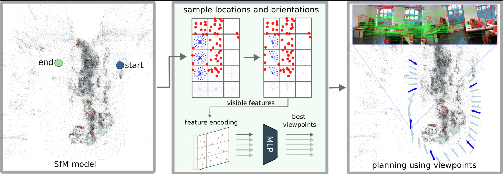

{{ page.authors }}

## Abstract

> Accurate localization in diverse environments is a fundamental challenge in computer vision and robotics. The task involves determining a sensor's precise position and orientation, typically a camera, within a given space. Traditional localization methods often rely on passive sensing, which may struggle in scenarios with limited features or dynamic environments. In response, this paper explores the domain of active localization, emphasizing the importance of viewpoint selection to enhance localization accuracy. Our contributions involve using a data-driven approach with a simple architecture designed for real-time operation, a self-supervised data training method, and the capability to consistently integrate our map into a planning framework tailored for real-world robotics applications. Our results demonstrate that our method performs better than the existing one, targeting similar problems and generalizing on synthetic and real data. We also release an open-source implementation to benefit the community.

## Resources

<a href=" {{ page.paperurl }} ">[pdf]</a> <a href=" {{ page.arxiv }} ">[arxiv]</a> <a href=" {{ page.code }} ">[github]</a> <a href=" {{ page.video }} ">[video]</a> <a href=" {{ page.poster }} ">[video]</a>

## Bibtex 
@inproceedings{di2024learning,
  title={Learning Where to Look: Self-supervised Viewpoint Selection for Active Localization Using Geometrical Information},
  author={Di Giammarino, Luca and Sun, Boyang and Grisetti, Giorgio and Pollefeys, Marc and Blum, Hermann and Barath, Daniel},
  booktitle={European Conference on Computer Vision},
  pages={188--205},
  year={2024},
  organization={Springer}
}