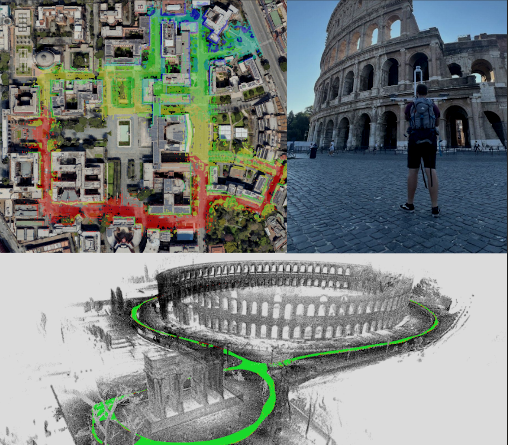

{{ page.authors }}

## Abstract

> This paper presents a vision and perception research dataset collected in Rome, featuring RGB data, 3D point clouds, IMU, and GPS data. We introduce a new benchmark targeting visual odometry and SLAM, to advance the research in autonomous robotics and computer vision. This work complements existing datasets by simultaneously addressing several issues, such as environment diversity, motion patterns, and sensor frequency. It uses up-to-date devices and presents effective procedures to accurately calibrate the intrinsic and extrinsic of the sensors while addressing temporal synchronization. During recording, we cover multi-floor buildings, gardens, urban and highway scenarios. Combining handheld and car-based data collections, our setup can simulate any robot (quadrupeds, quadrotors, autonomous vehicles). The dataset includes an accurate 6-dof ground truth based on a novel methodology that refines the RTK-GPS estimate with LiDAR  point clouds through Bundle Adjustment (BA). All sequences divided in training and testing are accessible at www.rvp-group.net/datasets/slam.

## Resources

<a href=" {{ page.paperurl }} ">[pdf]</a> <a href=" {{ page.arxiv }} ">[arxiv]</a> <a href=" {{ page.code }} ">[github]</a> <a href=" {{ page.video }} ">[video]</a> <a href=" {{ page.poster }} ">[video]</a>

## Bibtex 
 @inproceedings{brizi2024vbr,
  title={VBR: a vision benchmark in Rome},
  author={Brizi, Leonardo and Giacomini, Emanuele and Di Giammarino, Luca and Ferrari, Simone and Salem, Omar and De Rebotti, Lorenzo and Grisetti, Giorgio},
  booktitle={2024 IEEE International Conference on Robotics and Automation (ICRA)},
  pages={15868--15874},
  year={2024},
  organization={IEEE}
}