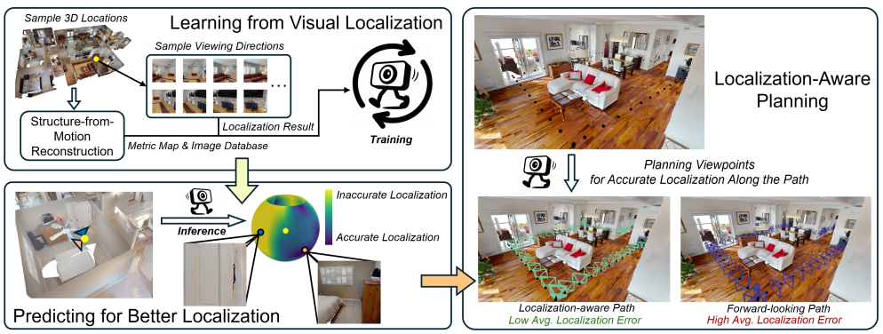

{{ page.authors }}

## Abstract

> Reliable localization is critical for robot navigation, yet most existing systems implicitly assume that all viewing directions at a location are equally informative. In practice, localization becomes unreliable when the robot observes unmapped, ambiguous, or uninformative regions. To address this, we present ActLoc, an active viewpoint-aware planning framework for enhancing localization accuracy for general robot navigation tasks. At its core, ActLoc employs a large-scale trained attention-based model for viewpoint selection. The model encodes a metric map and the camera poses used during map construction, and predicts localization accuracy across yaw and pitch directions at arbitrary 3D locations. These per-point accuracy distributions are incorporated into a path planner, enabling the robot to actively select camera orientations that maximize localization robustness while respecting task and motion constraints. ActLoc achieves state-of-the-art results on single-viewpoint selection and generalizes effectively to full-trajectory planning. Its modular design makes it readily applicable to diverse robot navigation and inspection tasks.

## Resources

<a href="https://arxiv.org/abs/2508.20981">[arxiv]</a>  

## Bibtex
@inproceedings{li2025actloc,
  title={ActLoc: Learning to Localize on the Move via Active Viewpoint Selection},
  author={Li, Jiajie and Sun, Boyang and Di Giammarino, Luca and Blum, Hermann and Pollefeys, Marc},
  booktitle={Proceedings of the Conference on Robot Learning (CoRL)},
  year={2025}
}
