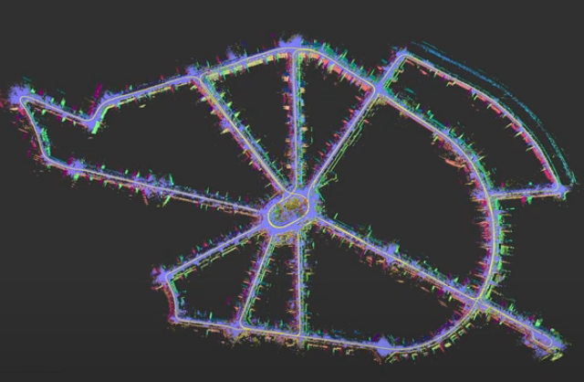

{{ page.authors }}

## Abstract

> The joint optimization of sensor poses and 3D structure is fundamental for state estimation in robotics and related fields. Current LiDAR systems often prioritize pose optimization, with structure refinement either omitted or treated separately using representations like signed distance functions or neural networks. This paper introduces a framework for simultaneous optimization of sensor poses and 3D map, represented as surfels. A generalized LiDAR uncertainty model is proposed to address degraded or less reliable measurements in varying scenarios. Experimental results on public datasets demonstrate improved performance over most comparable state-of-the-art methods. The system is provided as open-source software to support further research.

## Resources

<a href="https://arxiv.org/abs/2501.03972">[arxiv]</a>

## Bibtex
@article{cwian2025madba,
  title={MAD-BA: 3D LiDAR Bundle Adjustment — from Uncertainty Modelling to Structure Optimization},
  author={Ćwian, Krzysztof and Di Giammarino, Luca and Ferrari, Simone and Ciarfuglia, Thomas and Grisetti, Giorgio and Skrzypczyński, Piotr},
  journal={IEEE Robotics and Automation Letters},
  year={2025},
}
