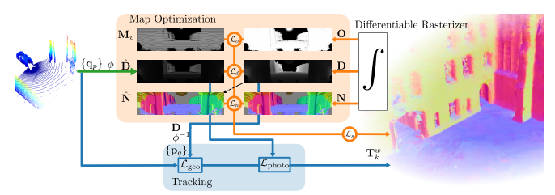

{{ page.authors }}

## Abstract

> LiDARs provide accurate geometric measurements, making them valuable for ego-motion estimation and reconstruction tasks. However, managing an accurate and lightweight environment representation remains challenging. This work pioneers the use of Gaussian primitives for a LiDAR odometry and mapping pipeline, using spherical projection to refine scene representation from LiDAR data. The approach achieves state-of-the-art mapping performance with minimal GPU requirements, while matching current standards in registration accuracy. Efficiency and effectiveness make it a promising step toward real-time SLAM solutions.

## Resources

<a href="https://arxiv.org/abs/2503.17491">[arxiv]</a>  

## Bibtex
@inproceedings{giacomini2025splatloam,
  title={Splat-LOAM: Gaussian Splatting LiDAR Odometry and Mapping},
  author={Giacomini, Emanuele and Di Giammarino, Luca and De Rebotti, Lorenzo and Grisetti, Giorgio and Oswald, Martin R.},
  booktitle={Proceedings of the IEEE/CVF International Conference on Computer Vision (ICCV)},
  year={2025}
}
